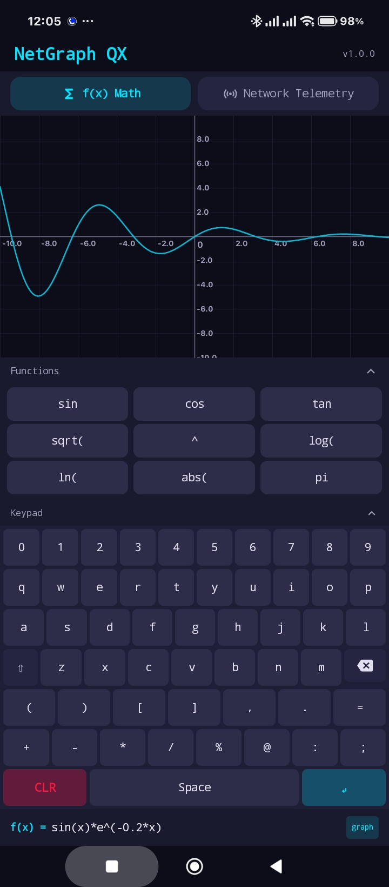

# NetGraph QX

**Hybrid graphing calculator and real-time network/hardware telemetry terminal for Android.**

[]()
[]()
[]()
[]()

<p align="center">
  
</p>

---

## Features

### Dual-Mode Architecture

Toggle between two distinct operational modes:

**1. Mathematical Function Graphing** &mdash; Plot any `f(x)` expression in real time on a touch-interactive Cartesian grid.

**2. Network & Hardware Telemetry** &mdash; Live-streaming waveforms for ping latency, packet loss, CPU load, and memory pressure with color-coded status thresholds.

### Three-Section Layout

The screen is partitioned into three collapsible sections to make full use of the viewport:

| Section | Content | Collapsible |
|---|---|---|
| **Canvas** (40&ndash;100%) | 60 FPS graph rendering with grid, curves, and coordinate tracing | No |
| **Function Pad** (25%) | Quick-access math functions or telemetry macros | Yes |
| **In-App Keypad** (35%) | Full QWERTY key matrix &mdash; no OS keyboard needed | Yes |

### Math Engine

- Expression parsing via **exp4j**
- Supported functions: `sin`, `cos`, `tan`, `sqrt`, `log`, `ln`, `abs`, `^` (power)
- Touch gestures: **pan** (drag), **pinch-to-zoom**, **tap-to-trace** with coordinate tooltip

### Telemetry Engine

- Coroutine-based `Flow<TelemetryTick>` at 250ms intervals
- Simulated metrics: ICMP ping latency, packet loss, CPU load, memory pressure
- Composite status with green/yellow/red thresholds
- 300-entry ring buffer for waveform rendering

---

## Getting Started

### Prerequisites

- **Android Studio** Hedgehog (2023.1.1) or later
- **JDK** 17+
- **Android SDK** platform 36, build-tools 36+

### Build from Source

```bash
git clone https://github.com/YOUR_USERNAME/NetGraphQX.git
cd NetGraphQX

# Build debug APK
./gradlew assembleDebug

# Install on connected device
adb install app/build/outputs/apk/debug/app-debug.apk
```

### Quick Install

Download the latest APK from the [Releases](https://github.com/YOUR_USERNAME/NetGraphQX/releases) page and side-load on any Android device (API 26+).

---

## Usage Guide

### Graphing a Function

1. Tap the **f(x) Math** pill at the top
2. Type your expression using the built-in keypad (e.g., `sin(x)`, `x^2 + 3*x - 4`)
3. The curve appears instantly on the canvas
4. **Drag** to pan, **pinch** to zoom, **tap** to trace coordinates

### Evaluating Arithmetic

Expressions without an `x` variable are evaluated immediately and the result is shown in the bottom bar:

| Input | Display |
|---|---|
| `2+2` | `2+2 = 4` |
| `sqrt(144)` | `sqrt(144) = 12` |
| `sin(3.14159/2)` | `sin(3.14159/2) = 1` |

### Viewing Telemetry

1. Tap the **Network Telemetry** pill
2. The waveform begins streaming automatically
3. Metric values (PING, LOSS, CPU, MEM) are color-coded:
   - **Green** &mdash; Optimal
   - **Yellow** &mdash; Degraded
   - **Red** &mdash; Critical

---

## Project Structure

```
NetGraph QX/
├── app/
│   ├── build.gradle.kts
│   └── src/main/
│       ├── AndroidManifest.xml
│       ├── res/
│       └── java/com/netgraphqx/
│           ├── MainActivity.kt          # Root composable with 3-section layout
│           ├── model/AppState.kt         # AppMode, TelemetryTick, Viewport, etc.
│           ├── theme/                    # Color, Typography, Material3 theme
│           ├── engine/
│           │   ├── MathEngine.kt         # exp4j expression wrapper
│           │   └── TelemetryEngine.kt    # Coroutine-based data streaming
│           └── ui/
│               ├── GraphCanvas.kt        # Compose Canvas rendering (60 FPS)
│               ├── ModeSelector.kt       # Mode toggle pills
│               ├── FunctionPad.kt        # Quick-access function buttons
│               └── InAppKeypad.kt        # Custom QWERTY key matrix
├── APKs/                                 # Pre-built debug APKs (versioned)
├── screenshots/                          # App screenshots
├── CHANGELOG.md                          # Version history
├── build.gradle.kts                      # Root build configuration
├── settings.gradle.kts
└── gradle/
```

---

## Tech Stack

| Component | Technology |
|---|---|
| Language | Kotlin 2.0.21 |
| UI Framework | Jetpack Compose with Material 3 |
| Graphics | Compose Canvas API |
| Math Parsing | exp4j 0.4.8 |
| Async | Kotlin Coroutines 1.9.0 |
| Build | Gradle 8.9, AGP 8.7.2 |
| Minimum SDK | 26 (Android 8.0) |
| Target SDK | 36 |

---

## Versioning

See [CHANGELOG.md](CHANGELOG.md) for the full release history.

Each release produces a versioned APK artifact in the `APKs/` directory (e.g., `NetGraphQX-v1.0.2.apk`) alongside the latest `NetGraphQX-debug.apk`.

---

## License

ISC License &mdash; see [LICENSE](LICENSE) for details.
